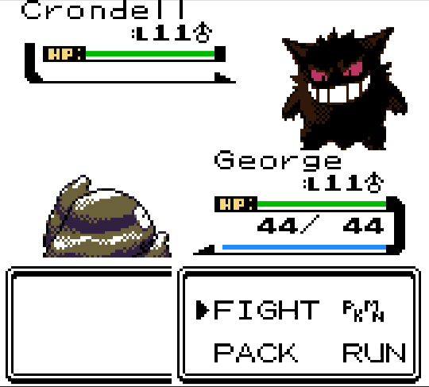
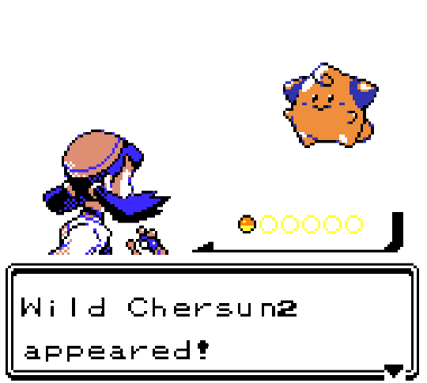
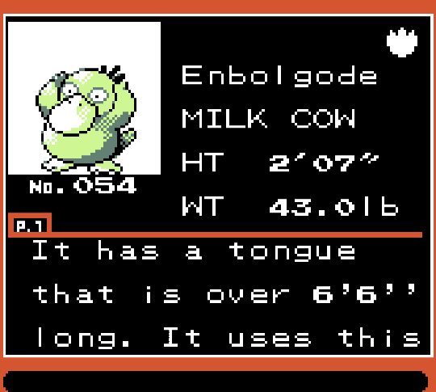
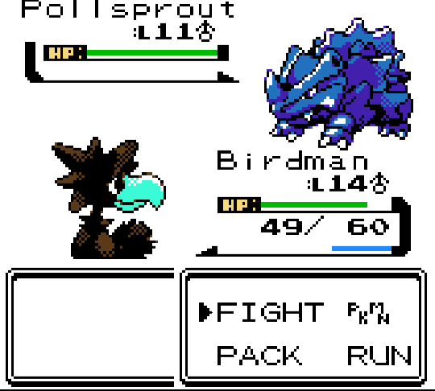
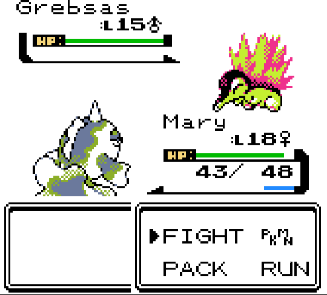
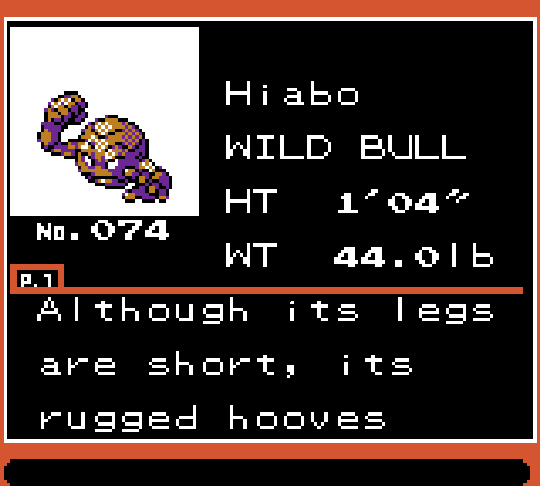
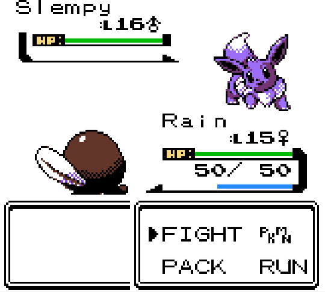
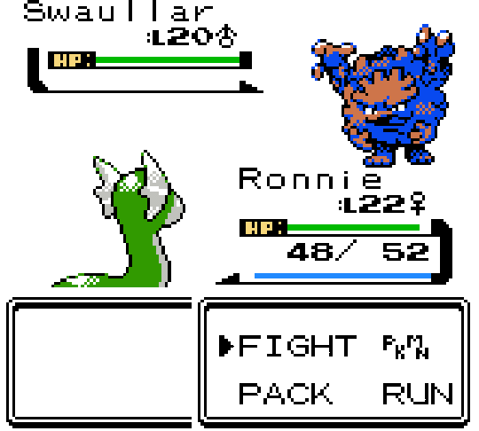

random-crystal
==============

## Motivation

I was playing a randomized version of Pokemon Crystal, created using the [Universal Pokemon Randomizer](https://pokehacks.dabomstew.com/randomizer/). I like the part where you can randomize e.g. pokemon types and movesets, but obviously it's confusing because they have the same names as regular pokemon. So, I created some additional randomizer scripts that can randomize additional aspects of the game so it seems like the pokemon are completely different.

Unfortunately, these only work on Pokemon Crystal. (The offsets are all different for Gold/Silver, although it would be cool to add the G/S offsets at some point as well as an option.)

## Contents

- `randomize_names.pl`: Constructs random pokemon names using a silly algorithm I wrote based on the C/V pattern of existing pokemon names. It's sort of hard to explain but works better than it seems like it should.
- `randomize_palette_shuffle.pl`: Independently shuffles the first (light) and second (dark) colors of the pokemon palettes and shiny palettes. Usually works all right but sometimes you end up with [an abomination](images/bad-palette.png). So I recommend using `randomize_palette_hue.pl` instead.
- `randomize_palette_hue.pl`: Randomly alters the hue of the colors of the pokemon palettes, trying to ensure it's not too similar to the original colors (since it's disappointing in the shuffle version when you just end up with a really similar color.) Preserves the luma (i.e. brightness) of the original color by using the [YIQ](https://en.wikipedia.org/wiki/YIQ) color space, to make the art still look good and decrease chances of abominations.
- `randomize_pokedex.pl`: Shuffles the short (`SEED`, `FLAME`, etc) and long (`While it is young, ...`) pokedex descriptions of each pokemon.
- `read_colors.pl`: Reads the color palette of each pokemon and outputs it as html to `stdout`. You can pipe it to an html file and view it in your browser. This was useful for me while testing the palette randomizer, and it could be fun if you just want to explore the pokemon color palettes, since it's kind of cool how all the art is just done with 2 colors + white + black.
- `pokemon.txt`: This is just a list of pokemon names. It's an auxiliary file used by `randomize_names.pl` and `read_colors.pl`.

All these scripts can be run from the command line. The first parameter should be the input ROM, and the second parameter should be the output ROM. (except `read_colors`, where the input is the ROM and the output is just printed to the console.)

## Screenshots

